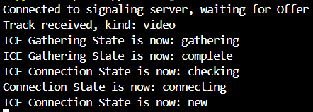

# 實作三 : 嫁接模型進行推論
目標：在不連接外網的條件下，實現peer-to-peer影像串流，將peer1鏡頭影像串流給peer2。peer2在接收到影像時會串流給模型，並將模型推論結果串流回peer1。peer1同時顯示擷取到的本地影像以及推論結果。

主要角色：
* **Model on Laptop**
* HTTPs Server on Laptop
* Signaling Server on Laptop
* Peer 1 on Laptop
* Peer 2 on Smart phone
* Connection: through common Wi-Fi

code: https://github.com/SheridanM551/WebRTC/tree/main/phase3

# 使用說明
請依序進行
## 環境
1. npm 部分因為我不小心把node_modules上傳了所以不用
2. python:
``` bash=
    pip install -r requirement.txt
```
    如果遇到不能裝或其他相容問題，可以手動一個一個裝看看。
3. 模型
    我使用的是YOLOv8模型，嘗試過onnx、tensorRT都沒問題。只要把模型放在 phase3/ 底下，執行peer2.py加上--model參數，調整成模型的名稱即可。如果使用其他模型需要修改peer2。預處理部分也需要根據自己的情況調整(在peer2.py有對應函數)。
## 開啟防火牆 port 3000 (如果無法連線可能是這個問題，後來測試好像沒有也沒差)
參考：https://wiki.mcneel.com/zh-tw/zoo/window7firewall

## SignalingServer run 在筆電 or nano/xavier
shell:
```bash
    node server.js
```
## peer2 接收端 一樣 run 在筆電 or nano/xavier
shell輸入(開啟另一個終端)：
```bash
    python3 peer2.py (--recv 1) (--inferenced 1)
```
參數：
* recv: 啟用opencv，讓peer2顯示接收到的畫面。按q結束畫面。
* inferenced: 啟用opencv，讓peer2顯示推論結果(包含bbox)。按q結束畫面。

細節：
* 當python log只顯示：Connected to signaling server, waiting for Offer，代表在等peer1送訊號，如果你先啟動peer1，就再點一次set server ip。
* 正常執行結果：
* 不須使用瀏覽器。不過一樣可以打開https://{你的筆電的wifi ipv4}:3000/，檢查有沒有架好server。

## peer1 上傳端 run 在智慧影鏡或手機
瀏覽器開啟：https://{你的筆電的wifi ipv4}:3000/

**請注意第一次一定要手動輸入https://**

~~查詢你的筆電的wifi ipv4： cmd ipconfig (on windows)~~

執行server.js應該會自動印出wifi ipv4了。

網址輸入筆電的ip。(理論上自動填入了)

## 實作細節：
* 考慮到phase2 peer2是在瀏覽器上執行，會導致無法取得原始影像流(這牽涉到瀏覽器與RTC的安全性)，所以需要使用python aiortc代替peer2的角色。
* 關於接收到的解析度，webRTC會自動調整實際傳送的大小，不過**可以設定最大上限**，比如1280x720，那它可能會從640x360->960x540->1280x720這樣逐漸上調(如果頻寬足夠)。不過**無法絕對地限制大小**。每次自動切換時機，大概是10~20sec一次。
* FPS也可以調整最大值。預設30。
* 嘗試過使用手機5G基地台並關閉外網，可以到2560x1440，但不穩定。